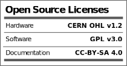

[Certification Mark Generator](https://oshwa.github.io/certification-mark-generator/)
===

Note: this isn't working yet. Need to figure out how to host an SVG that is not cached. In the meantime you can use this:

[oshwa.github.io/certification-mark-generator](https://oshwa.github.io/certification-mark-generator/)

---

[Open Hardware Facts](https://oshwa.github.io/certification-mark-generator/facts)
===

This graphic can be used to show what 3 licenses you are using with your open source hardware, as recommended by [OSHWA](https://certification.oshwa.org/process.html).

SVGs can be generated at [oshwa.github.io/certification-mark-generator/facts](https://oshwa.github.io/certification-mark-generator/facts).

Certification site: [certification.oshwa.org](http://certification.oshwa.org/)

Pregenerated
--

Some common combinations will be pre-generated and hosted here for use:

| | |
|---|---|
|  | [CERN-OHL-2.0-S_GPL-3.0-only_CC-BY-SA-4.0.svg](https://oshwa.github.io/certification-mark-generator/premade/CERN-OHL-2.0-S_GPL-3.0-only_CC-BY-SA-4.0.svg) |
|  | [CERN-OHL-1.2_GPL-3.0-only_CC-BY-SA-4.0.svg](https://oshwa.github.io/certification-mark-generator/premade/CERN-OHL-1.2_GPL-3.0-only_CC-BY-SA-4.0.svg) |

****

## Testing area

This ought to display the certification mark SVG:

